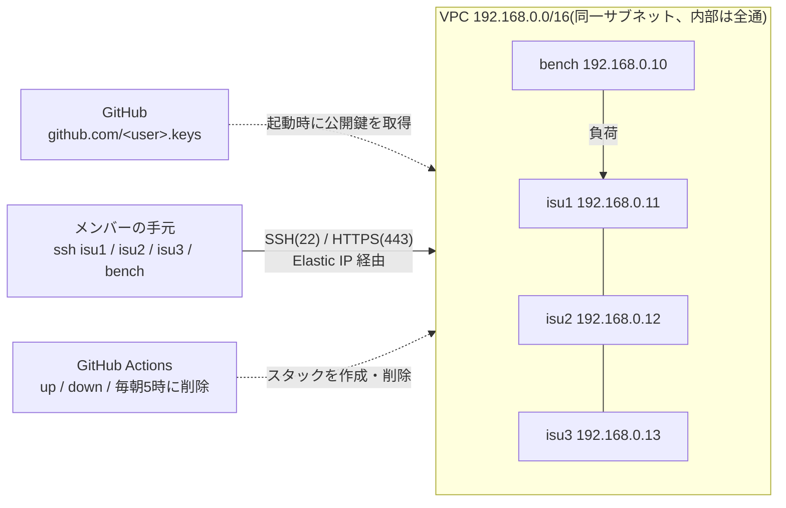

# isucon-practice-env

[](https://github.com/Hee-San/isucon-practice-env/actions/workflows/practice-env.yml)

ISUCON の過去問をチームで解くための AWS 練習環境です。本番(ISUCON13・14)と同じく
「CloudFormation で競技サーバが建ち、GitHub に登録した SSH 鍵で `isucon` ユーザーに入れる」形を再現し、
本番では運営が持っていたベンチマーカーを同じ VPC に1台足します。

作成と削除は GitHub Actions のボタンで行います。使わない間はスタックごと削除するので、課金はゼロになります。
上のバッジがいまの状態です(緑 = 何も動いていない、橙 = 稼働中で課金中、赤 = 作成失敗などで残っている)。



## 対応している回

| 回 | 構成 | AMI |
|---|---|---|
| ISUCON14 | 競技 `c5.large`×3 + ベンチ `c5.xlarge` | [matsuu/aws-isucon](https://github.com/matsuu/aws-isucon) |
| ISUCON13 | 同上(ディスク 40GB) | 同上 |
| ISUCON12 予選 | 同上 | 同上 |
| ISUCON11 予選 | 同上 | 同上 |
| private-isu | 競技 `c7a.large`×1 + ベンチ `c7a.xlarge`(80 番も開放) | [catatsuy/private-isu](https://github.com/catatsuy/private-isu) |

AMI ID は `.github/workflows/practice-env.yml` の `case` 文に書いてあります。配布元で差し替えられたら、そこを直してください。

## 公開リポジトリで隠しているもの

| 隠すもの | 方法 |
|---|---|
| サーバの IP | Summary には平文で出さず、メンバーの GitHub 公開鍵(ed25519 / RSA)で暗号化した `ssh_config` だけを出します。ログでもマスクします |
| AWS のアカウント ID | Secret に置き、`configure-aws-credentials` の `mask-aws-account-id` でログからも隠します。ロール名は `github-actions-isucon` に固定しています |
| メンバーの GitHub ユーザー名 | Secret に置きます |

AWS のロールを引き受けられるのは、このリポジトリの main ブランチのワークフローだけです。
ワークフローを実行できるのも、リポジトリに書き込み権限がある人だけです。
使う Action はコミット SHA で固定しています。

## 初回設定(1回だけ)

1. [AWS CloudShell(東京リージョン)](https://ap-northeast-1.console.aws.amazon.com/cloudshell/home?region=ap-northeast-1) を開き、次の1行を貼って実行します

   ```bash
   curl -fsSL https://raw.githubusercontent.com/Hee-San/isucon-practice-env/main/scripts/bootstrap.sh | bash
   ```

   Actions 用の IAM ロール(`cloudformation/github-oidc.yaml`)をスタック `github-actions-isucon` として作り、最後に Secret に登録するアカウント ID を表示します。
   アカウントに GitHub の OIDC プロバイダが既にあるかは自動で判定します。何度実行しても大丈夫です
2. 表示されたリンク(このリポジトリの「Settings」→「Secrets and variables」→「Actions」)で、Secret を2つ作ります

   | 名前 | 値 |
   |---|---|
   | `AWS_ACCOUNT_ID` | 手順1で表示された12桁のアカウント ID |
   | `ISUCON_GITHUB_USERS` | メンバーの GitHub ユーザー名をスペース区切りで(例: `alice bob carol`) |

3. 「Actions」→「practice-env」→「Run workflow」を `status` で1回実行します。バッジが作られ、AWS に入れることの確認にもなります

CloudShell を使わない場合は、CloudFormation コンソールで `cloudformation/github-oidc.yaml` をアップロードしても作れます
(最後の画面で「カスタム名のついた IAM リソース」作成の承認にチェックを入れ、OIDC プロバイダが既にあるならパラメータ `CreateOIDCProvider` を `false` にします)。
CloudFormation の「Launch Stack」リンクはテンプレートを S3 に置かないと使えないため、用意していません。

あわせて、AWS の「Service Quotas」で東京リージョンの「Running On-Demand Standard (A, C, D, H, I, M, R, T, Z) instances」が
**10 以上**あるか確かめてください(4台で 10 vCPU 使います)。
同じ回を複数同時に建てるなら、その台数分(2つなら 20 以上)が要ります。

## メンバーの事前準備(各自1回だけ)

サーバには、各自が GitHub に登録した SSH 公開鍵で入ります。暗号化した `ssh_config` も同じ鍵で開きます。
**手元の秘密鍵が、自分の GitHub アカウントに登録されているか**を先に確かめてください。
`ssh -T git@github.com` が通っていても、別のアカウントの鍵や、別の PC の鍵しか登録されていないことがあります。

1. `age` を入れます(`brew install age` など)
2. 手元の鍵のうち、自分の GitHub アカウントに登録されているものを探します(`<GitHub ユーザー名>` を自分の名前に)

   ```bash
   keys=$(curl -s https://github.com/<GitHub ユーザー名>.keys); for f in ~/.ssh/*.pub; do echo "$keys" | grep -qF "$(cut -d' ' -f2 "$f")" && echo "登録済み: ${f%.pub}"; done
   ```

3. 何も出なければ、鍵を作って登録します。`~/.ssh/id_ed25519` は ssh が自動で試す名前なので、ほかの開発にもそのまま使えます。
   1行目は保存先を聞かれたらそのまま Enter、2行目で公開鍵をコピーしたら https://github.com/settings/ssh/new に貼って登録します

   ```bash
   ssh-keygen -t ed25519
   pbcopy < ~/.ssh/id_ed25519.pub
   ```

   age が扱えるのは ed25519 と RSA の鍵だけです(ECDSA や `sk-` で始まる鍵は使えません)。
   鍵を登録した後に作った環境でないと、サーバには入れません(公開鍵は起動時に1回だけ取り込むため)。

## 使い方

### 作る

1. 「Actions」→「practice-env」→「Run workflow」で、`action` を `up`、`problem` を練習する回にして実行します
2. 5分前後で終わります。実行結果の Summary に、手元で貼り付けるコマンドのブロックが出ます。
   **ブロックを丸ごと1回でコピーして**、手元のターミナルに貼り付けてください(秘密鍵が `~/.ssh/id_ed25519` でなければ、1行目の `K=` を書き換えてから)。
   中に入っている暗号化した `ssh_config` を復号し、前に足した設定を消してから、新しい設定を `~/.ssh/config` の末尾に足します

   - 足す設定は `# >>> isucon-practice >>>` 〜 `# <<< isucon-practice <<<` の目印で囲まれています。次に作ったとき(別の回でも)、この範囲が丸ごと置き換わります
   - サーバは作るたびに IP とホスト鍵が変わるので、この設定では known_hosts に記録せず、ホスト鍵の確認もしません
   - 目印の無い古い `Host isu1` などが残っていると、ssh は先に書かれたほうを使います。注意が出たら手で消してください

3. Summary の続きに、サーバに入るコマンドと、その回のマニュアル・出題動画・解説へのリンクが出ます。`ssh isu1` で入れます(ユーザーは `isucon`)

#### 同じ回を複数建てる

チームを分けて同じ回を同時に解くときは、2つ目以降の `up` で `name` に区別用の名前(英小文字と数字で10文字まで。例: `2`)を入れます。

- スタック名は `<回>-<name>`(例: `isucon14-2`)になり、1つ目とは別の VPC・別の IP で建ちます
- 手元の `ssh_config` の Host 名は `isu1-2` / `isu2-2` / `isu3-2` / `bench-2` になり、1つ目の `isu1` などとぶつかりません(目印も `isucon-practice-2` と別になるので、貼っても1つ目の設定は消えません)。
  サーバの中では今までどおり `isu1` / `bench` などの名前とプライベート IP(192.168.0.10〜13)で届きます
- ブラウザで見るための手元の `/etc/hosts` はドメインが同じなので、1台の PC からはどちらか一方しか向けられません(最後に貼った環境の行だけが残ります)
- 消すときも、作ったときと同じ `problem` と `name` で `down` します
- `name` は公開のログやバッジに出るので、GitHub ユーザー名は避けてください

### 起動後の初期作業

全員、手元の PC で4台に入れるか確かめます。

```bash
for h in isu1 isu2 isu3 bench; do ssh $h hostname; done
```

サーバに入って、次をやります。

```bash
# 全台: 運営用ユーザーが残っていれば消す(他人の公開鍵が入っている)
id isuadmin && sudo userdel -r isuadmin

# bench: アプリを止めてベンチに CPU を譲る
systemctl list-units --type=service --state=running | grep -E 'isu|nginx|mysql|pdns|memcached'
sudo systemctl disable --now <上で出たサービス名>
```

### 回ごとの使い方(Web ページとベンチ)

#### 共通

**サーバのグローバル IP は、手元の PC で次を実行して調べます。** サーバの中で実行すると、`/etc/hosts` に書いたプライベート IP の名前(`isu1` など)が返ってくるだけです。

```bash
ssh -G isu1 | awk '/^hostname /{print $2}'
```

逆に、サーバの中では `isu1` / `isu2` / `isu3` / `bench` の名前でプライベート IP(192.168.0.10〜13)に届きます。ベンチの向き先やサーバ間の接続には、こちらを使います。

ベンチは bench 機に入って実行します。打つ前にチームのチャンネルで宣言してください(同時に打つと互いのスコアが壊れます)。
初回だけ、bench 機で動いているアプリを止めて、ベンチに CPU を譲ります(止めるサービス名は回ごとのファイルにあります)。

ISUCON の回はアプリが独自ドメインと自己署名証明書の HTTPS で動くので、ブラウザで見るには手元の `/etc/hosts` に1行足します。
作成時の Summary に出るブロックを貼ると、行末に ` # isucon-practice` の目印を付けて1行足し、前に足した行は消します。
練習が終わったら、手元の PC で次を実行してその行を消してください。

```bash
h=$(grep -v ' # isucon-practice$' /etc/hosts) && printf '%s\n' "$h" | sudo tee /etc/hosts > /dev/null
```

#### 回ごと

作成時の Summary に、その回の分がそのまま出ます。あとから見るときは次を開いてください。
`name` を付けて作った環境では、手元で打つ `ssh isu1` などを `ssh isu1-<name>` に読み替えてください(Summary では置き換えて出します)。
資料(当日マニュアル・アプリケーションマニュアル・出題動画・解説)、Web ページの開き方、ベンチの回し方、使っている AMI の本番との違いが書いてあります。
`/etc/hosts` に書くブロックは、isu1 の IP を使うので作成時の Summary にだけ出ます。

| 回 | ファイル |
|---|---|
| ISUCON14 | [docs/problems/isucon14.md](docs/problems/isucon14.md) |
| ISUCON13(ベンチは未検証) | [docs/problems/isucon13.md](docs/problems/isucon13.md) |
| ISUCON12 予選(ベンチは未検証) | [docs/problems/isucon12-qualify.md](docs/problems/isucon12-qualify.md) |
| ISUCON11 予選(ベンチは未検証) | [docs/problems/isucon11-qualify.md](docs/problems/isucon11-qualify.md) |
| private-isu | [docs/problems/private-isu.md](docs/problems/private-isu.md) |

### 消す

「Run workflow」で `action` を `down`、`problem`(と `name`)を作ったときと同じにして実行します。
緑になれば、インスタンス・Elastic IP・EBS・VPC がすべて消えています。サーバ上の変更は消えるので、先にチームのリポジトリへ push してください。

**消し忘れても、毎日 05:00 JST に残っている練習環境をすべて削除します。** 徹夜で練習する日は、5時前に push しておいてください。
朝にバッジが橙のままなら自動削除が動いていないので、`down` で消してください。

## 費用

東京リージョン、オンデマンドの単価(2026-10 時点)での目安です。

| 状態 | 費用 |
|---|---|
| ISUCON の回(4台)が稼働中 | 約 $0.56/時。8時間で約 $4.5 |
| private-isu(2台)が稼働中 | 約 $0.40/時 |
| 同じ回を複数建てたとき | 上の額 × 建てた数 |
| 削除後 | $0 |

GitHub Actions は公開リポジトリなので無料です。AWS Budgets で予算アラートを設定しておくと安心です。

## 手で作る・消す

パラメータを細かく変えたいとき(ベンチ機の大きさ、AZ など)は、コンソールか CLI で作ります。
この場合はタグが付かないので、毎朝の自動削除の対象になりません。必ず手で消してください。

```bash
aws cloudformation deploy --region ap-northeast-1 \
  --stack-name isucon14 \
  --template-file cloudformation/practice-env.yaml \
  --parameter-overrides ImageId=ami-0fcf9e8e8675a9ee4 GitHubUsers="alice bob carol"

aws cloudformation delete-stack --region ap-northeast-1 --stack-name isucon14
```

| パラメータ | 既定値 | 意味 |
|---|---|---|
| `ImageId` | ISUCON14 の AMI | 練習する回の AMI ID |
| `GitHubUsers` | (必須) | 公開鍵を取り込む GitHub ユーザー名(スペース区切り) |
| `InstanceType` / `BenchInstanceType` | `c5.large` / `c5.xlarge` | 競技サーバとベンチのインスタンスタイプ |
| `ContestantCount` | `3` | 競技サーバの台数(`1` か `3`) |
| `VolumeSize` | `20` | ルートボリューム(GB) |
| `AvailabilityZone` | `ap-northeast-1c` | 作成に失敗したら `ap-northeast-1d` |
| `AllowedCidr` | `0.0.0.0/0` | 22/443(と 80)を開ける接続元 |
| `OpenHttp` | `false` | 80 番も開けるか |

## 落とし穴

| 症状 | 対処 |
|---|---|
| 作成が `Unsupported` で失敗する | その AZ にインスタンスタイプが無い。手で `AvailabilityZone` を変えて作る |
| 作成が vCPU の上限で失敗する | Service Quotas で上限を引き上げる |
| `ssh` が `Permission denied (publickey)` | その人の GitHub に鍵が登録されているか、`ISUCON_GITHUB_USERS` の綴りを確かめる |
| `age: error: no identity matched any of the recipients` | 使った秘密鍵が、自分の GitHub アカウントに登録されていない(または `ISUCON_GITHUB_USERS` に自分が入っていない)。「メンバーの事前準備」の手順2で確かめ、鍵を登録してから `down` → `up` で作り直す |
| `age: error: reading ".../id_ed25519": no such file` | 鍵の名前が違う。貼り付けるブロックの1行目 `K=` を自分の鍵にする |
| `ssh_config` を復号できない(上以外) | GitHub に登録した鍵が ECDSA などで、age が扱えない。ed25519 の鍵を GitHub に追加してから作り直す |
| `Could not assume role` | Secret `AWS_ACCOUNT_ID` の値が違う、または main 以外から実行した。失敗したジョブの最後のステップに、OIDC トークンの `sub` が出るので、`repo:Hee-San@8444945/isucon-practice-env@1404043632:ref:refs/heads/main` と一致するか見る(GitHub の新しい形式。リポジトリを作り直すと ID が変わるので、`bootstrap.sh` を実行し直す) |
| バッジが表示されない | `status` で1回実行する |
| 毎朝の自動削除が動かなくなった | 公開リポジトリは60日間動きが無いと定期実行が止まる。Actions 画面で有効にし直す |

## ファイル

| ファイル | 中身 |
|---|---|
| `cloudformation/practice-env.yaml` | 練習環境のテンプレート |
| `cloudformation/github-oidc.yaml` | Actions が引き受ける IAM ロール(初回に1回だけ作る) |
| `scripts/bootstrap.sh` | 初回設定。CloudShell で上のロールを作り、アカウント ID を表示する |
| `.github/workflows/practice-env.yml` | `up` / `down` / `status` と、毎朝5時の消し忘れ削除 |
| `scripts/update-badge.sh` | 状態バッジを作って `isucon-status` ブランチへ置く |
| `docs/problems/<回>.md` | 回ごとの資料・Web ページ・ベンチ。作成時の Summary にも出す |
| `scripts/render-problem.sh` | 上を Summary 向けに書き換える(見出しの番号、`/etc/hosts` のブロック、name 付きの Host 名) |
