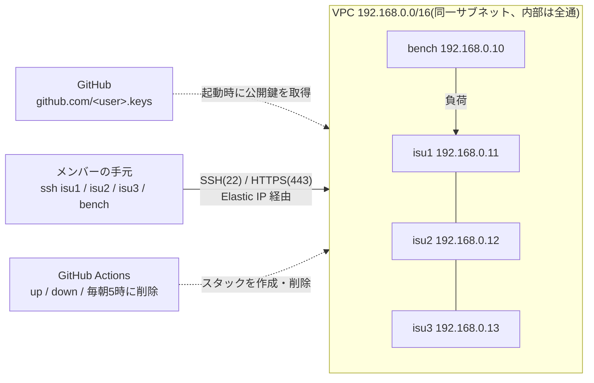

# isucon-practice-env

[](https://github.com/Hee-San/isucon-practice-env/actions/workflows/practice-env.yml)

ISUCON の過去問をチームで解くための AWS 練習環境です。本番(ISUCON13・14)と同じく
「CloudFormation で競技サーバが建ち、GitHub に登録した SSH 鍵で `isucon` ユーザーに入れる」形を再現し、
本番では運営が持っていたベンチマーカーを同じ VPC に1台足します。

作成と削除は GitHub Actions のボタンで行います。使わない間はスタックごと削除するので、課金はゼロになります。
上のバッジがいまの状態です(緑 = 何も動いていない、橙 = 稼働中で課金中、赤 = 作成失敗などで残っている)。



## 対応している回

| 回 | 構成 | AMI |
|---|---|---|
| ISUCON14 | 競技 `c5.large`×3 + ベンチ `c5.xlarge` | [matsuu/aws-isucon](https://github.com/matsuu/aws-isucon) |
| ISUCON13 | 同上(ディスク 40GB) | 同上 |
| ISUCON12 予選 | 同上 | 同上 |
| ISUCON11 予選 | 同上 | 同上 |
| private-isu | 競技 `c7a.large`×1 + ベンチ `c7a.xlarge`(80 番も開放) | [catatsuy/private-isu](https://github.com/catatsuy/private-isu) |

AMI ID は `.github/workflows/practice-env.yml` の `case` 文に書いてあります。配布元で差し替えられたら、そこを直してください。

## 公開リポジトリで隠しているもの

| 隠すもの | 方法 |
|---|---|
| サーバの IP | Summary には平文で出さず、メンバーの GitHub 公開鍵(ed25519 / RSA)で暗号化した `ssh_config` だけを出します。ログでもマスクします |
| AWS のアカウント ID | Secret に置き、`configure-aws-credentials` の `mask-aws-account-id` でログからも隠します。ロール名は `github-actions-isucon` に固定しています |
| メンバーの GitHub ユーザー名 | Secret に置きます |

AWS のロールを引き受けられるのは、このリポジトリの main ブランチのワークフローだけです。
ワークフローを実行できるのも、リポジトリに書き込み権限がある人だけです。
使う Action はコミット SHA で固定しています。

## 初回設定(1回だけ)

1. [AWS CloudShell(東京リージョン)](https://ap-northeast-1.console.aws.amazon.com/cloudshell/home?region=ap-northeast-1) を開き、次の1行を貼って実行します

   ```bash
   curl -fsSL https://raw.githubusercontent.com/Hee-San/isucon-practice-env/main/scripts/bootstrap.sh | bash
   ```

   Actions 用の IAM ロール(`cloudformation/github-oidc.yaml`)をスタック `github-actions-isucon` として作り、最後に Secret に登録するアカウント ID を表示します。
   アカウントに GitHub の OIDC プロバイダが既にあるかは自動で判定します。何度実行しても大丈夫です
2. 表示されたリンク(このリポジトリの「Settings」→「Secrets and variables」→「Actions」)で、Secret を2つ作ります

   | 名前 | 値 |
   |---|---|
   | `AWS_ACCOUNT_ID` | 手順1で表示された12桁のアカウント ID |
   | `ISUCON_GITHUB_USERS` | メンバーの GitHub ユーザー名をスペース区切りで(例: `alice bob carol`) |

3. 「Actions」→「practice-env」→「Run workflow」を `status` で1回実行します。バッジが作られ、AWS に入れることの確認にもなります

CloudShell を使わない場合は、CloudFormation コンソールで `cloudformation/github-oidc.yaml` をアップロードしても作れます
(最後の画面で「カスタム名のついた IAM リソース」作成の承認にチェックを入れ、OIDC プロバイダが既にあるならパラメータ `CreateOIDCProvider` を `false` にします)。
CloudFormation の「Launch Stack」リンクはテンプレートを S3 に置かないと使えないため、用意していません。

あわせて、AWS の「Service Quotas」で東京リージョンの「Running On-Demand Standard (A, C, D, H, I, M, R, T, Z) instances」が
**10 以上**あるか確かめてください(4台で 10 vCPU 使います)。メンバー全員に `age` を入れてもらいます(`brew install age` など)。

## 使い方

### 作る

1. 「Actions」→「practice-env」→「Run workflow」で、`action` を `up`、`problem` を練習する回にして実行します
2. 5分前後で終わります。実行結果の Summary に暗号化された `ssh_config` が出るので、コピーして手元で復号してください

   ```bash
   pbpaste | age -d -i ~/.ssh/id_ed25519 >> ~/.ssh/config   # macOS の例。RSA なら ~/.ssh/id_rsa
   ```

3. `ssh isu1` で入れます(ユーザーは `isucon`)

### 起動後の初期作業

```bash
# 全員: 4台に入れるか確かめる
for h in isu1 isu2 isu3 bench; do ssh -o StrictHostKeyChecking=accept-new $h hostname; done

# 全台: 運営用ユーザーが残っていれば消す(他人の公開鍵が入っている)
id isuadmin && sudo userdel -r isuadmin

# bench: アプリを止めてベンチに CPU を譲る
systemctl list-units --type=service --state=running | grep -E 'isu|nginx|mysql|pdns|memcached'
sudo systemctl disable --now <上で出たサービス名>
```

### ベンチを回す

bench に入って実行します。打つ前にチームのチャンネルで宣言してください(同時に打つと互いのスコアが壊れます)。

| 回 | コマンド |
|---|---|
| ISUCON14 | `./bench run . run --addr 192.168.0.11:443 --target https://isuride.xiv.isucon.net --payment-url http://192.168.0.10:12346 --payment-bind-port 12346` |
| ISUCON13 | isu1 の `~/env.sh` で `ISUCON13_POWERDNS_SUBDOMAIN_ADDRESS="192.168.0.11"` にしてアプリを再起動してから、`./bench run --enable-ssl --target https://pipe.u.isucon.local --nameserver 192.168.0.11 --webapp 192.168.0.12 --webapp 192.168.0.13`(未検証) |
| ISUCON12 予選 | `./bench -target-addr 192.168.0.11:443`(未検証) |
| ISUCON11 予選 | `./bench -tls -target=192.168.0.11 -all-addresses=192.168.0.11,192.168.0.12,192.168.0.13 -jia-service-url http://192.168.0.10:5000`(未検証) |
| private-isu | `/home/isucon/private_isu/benchmarker/bin/benchmarker -u /home/isucon/private_isu/benchmarker/userdata -t http://192.168.0.11` |

### 消す

「Run workflow」で `action` を `down`、`problem` を作ったときと同じ回にして実行します。
緑になれば、インスタンス・Elastic IP・EBS・VPC がすべて消えています。サーバ上の変更は消えるので、先にチームのリポジトリへ push してください。

**消し忘れても、毎日 05:00 JST に残っている練習環境をすべて削除します。** 徹夜で練習する日は、5時前に push しておいてください。
朝にバッジが橙のままなら自動削除が動いていないので、`down` で消してください。

## 費用

東京リージョン、オンデマンドの単価(2026-10 時点)での目安です。

| 状態 | 費用 |
|---|---|
| ISUCON の回(4台)が稼働中 | 約 $0.56/時。8時間で約 $4.5 |
| private-isu(2台)が稼働中 | 約 $0.40/時 |
| 削除後 | $0 |

GitHub Actions は公開リポジトリなので無料です。AWS Budgets で予算アラートを設定しておくと安心です。

## 手で作る・消す

パラメータを細かく変えたいとき(ベンチ機の大きさ、AZ など)は、コンソールか CLI で作ります。
この場合はタグが付かないので、毎朝の自動削除の対象になりません。必ず手で消してください。

```bash
aws cloudformation deploy --region ap-northeast-1 \
  --stack-name isucon14 \
  --template-file cloudformation/practice-env.yaml \
  --parameter-overrides ImageId=ami-0fcf9e8e8675a9ee4 GitHubUsers="alice bob carol"

aws cloudformation delete-stack --region ap-northeast-1 --stack-name isucon14
```

| パラメータ | 既定値 | 意味 |
|---|---|---|
| `ImageId` | ISUCON14 の AMI | 練習する回の AMI ID |
| `GitHubUsers` | (必須) | 公開鍵を取り込む GitHub ユーザー名(スペース区切り) |
| `InstanceType` / `BenchInstanceType` | `c5.large` / `c5.xlarge` | 競技サーバとベンチのインスタンスタイプ |
| `ContestantCount` | `3` | 競技サーバの台数(`1` か `3`) |
| `VolumeSize` | `20` | ルートボリューム(GB) |
| `AvailabilityZone` | `ap-northeast-1c` | 作成に失敗したら `ap-northeast-1d` |
| `AllowedCidr` | `0.0.0.0/0` | 22/443(と 80)を開ける接続元 |
| `OpenHttp` | `false` | 80 番も開けるか |

## 落とし穴

| 症状 | 対処 |
|---|---|
| 作成が `Unsupported` で失敗する | その AZ にインスタンスタイプが無い。手で `AvailabilityZone` を変えて作る |
| 作成が vCPU の上限で失敗する | Service Quotas で上限を引き上げる |
| `ssh` が `Permission denied (publickey)` | その人の GitHub に鍵が登録されているか、`ISUCON_GITHUB_USERS` の綴りを確かめる |
| `ssh_config` を復号できない | GitHub に登録した鍵が ECDSA などで、age が扱えない。ed25519 の鍵を GitHub に追加してから作り直す |
| `Could not assume role` | Secret `AWS_ACCOUNT_ID` の値が違う、または main 以外から実行した。失敗したジョブの最後のステップに、OIDC トークンの `sub` が出るので、`repo:Hee-San/isucon-practice-env:ref:refs/heads/main` と一致するか見る |
| バッジが表示されない | `status` で1回実行する |
| 毎朝の自動削除が動かなくなった | 公開リポジトリは60日間動きが無いと定期実行が止まる。Actions 画面で有効にし直す |

## ファイル

| ファイル | 中身 |
|---|---|
| `cloudformation/practice-env.yaml` | 練習環境のテンプレート |
| `cloudformation/github-oidc.yaml` | Actions が引き受ける IAM ロール(初回に1回だけ作る) |
| `scripts/bootstrap.sh` | 初回設定。CloudShell で上のロールを作り、アカウント ID を表示する |
| `.github/workflows/practice-env.yml` | `up` / `down` / `status` と、毎朝5時の消し忘れ削除 |
| `scripts/update-badge.sh` | 状態バッジを作って `isucon-status` ブランチへ置く |
